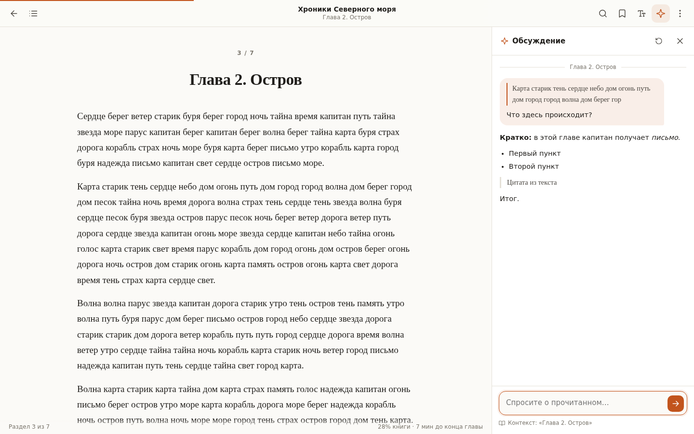
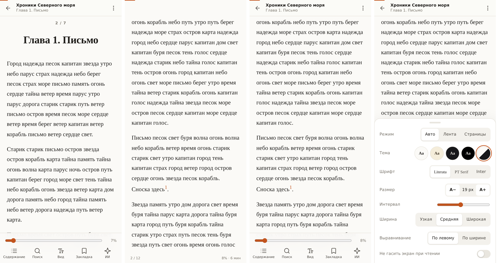

# reader3+

Доработанная версия [karpathy/reader3](https://github.com/karpathy/reader3): EPUB-читалка, которая работает у вас на компьютере. Её задача — удобно читать книги вместе с LLM.



## Возможности

**Библиотека**
- Обложки книг. Если обложки нет, рисуется своя, из названия.
- Прогресс чтения по каждой книге и блок «Продолжить чтение».
- Книги можно перетащить мышью на страницу или выбрать кнопкой. Командная строка не нужна.
- Поиск и сортировка: недавние, добавленные, по названию, по автору, по прогрессу.
- Удаление книги и сброс прогресса.

**Чтение**
- Позиция запоминается на сервере с точностью до места в главе. Книга открывается там, где вы остановились.
- Полоса прогресса книги, процент и примерное время до конца главы и до конца книги.
- Оглавление с вложенными разделами, временем чтения и отметкой текущей главы.
- Ссылки внутри книги работают: сноски и перекрёстные ссылки. Кнопка «Назад» в браузере возвращает на прежнее место.
- Полнотекстовый поиск по книге с фрагментами текста и подсветкой найденного.
- Выделения четырьмя цветами, заметки, закладки и экспорт заметок в Markdown.
- Оформление: светлая тема, сепия, тёмная, чёрная (OLED) или как в системе. Три шрифта (Literata, PT Serif, Inter), размер, межстрочный интервал, ширина колонки, выравнивание по ширине с переносами.
- Два режима: лента (прокрутка) и страницы. Режим «Авто» включает страницы на сенсорных устройствах и ленту на компьютере.
- Горячие клавиши (полный список — по `?`).

**Телефон и планшет**
- Страницы листаются свайпом (страница едет за пальцем) или нажатием на левый или правый край экрана. Нажатие в центре показывает и прячет панели.
- На телефоне все кнопки собраны в нижней панели, под большим пальцем: оглавление, поиск, оформление, закладка, ИИ. Там же ползунок для перехода в любое место книги с подсказкой, какая это глава.
- Оформление и меню открываются снизу, как в мобильных приложениях. Боковые панели закрываются свайпом.
- Учитываются вырез экрана и закруглённые углы, а поле ввода в чате не прячется за экранной клавиатурой.
- При повороте экрана и смене шрифта страницы пересчитываются, а место чтения сохраняется.
- Можно запретить экрану гаснуть во время чтения.
- Читалку можно установить на главный экран как приложение (PWA).

**ИИ-компаньон** (Claude)
- Чат о книге в боковой панели. В контекст запроса передаются данные о книге и полный текст текущей главы.
- Можно выделить фрагмент и нажать «Спросить»: он попадёт в вопрос как цитата.
- Готовые подсказки: пересказ, объяснение сложных мест, исторический контекст, вопросы для самопроверки.
- Модель старается не раскрывать сюжет дальше текущей главы.
- Без API-ключа остаётся кнопка «Копировать главу для LLM»: она копирует главу с готовым промптом, который можно вставить в любой чат.



## Запуск

Нужен только [uv](https://docs.astral.sh/uv/).

```bash
uv run server.py
```

Откройте http://localhost:8123 и перетащите EPUB-файлы на страницу. Бесплатные книги есть, например, на [Project Gutenberg](https://www.gutenberg.org/) и [Standard Ebooks](https://standardebooks.org/).

Книги можно добавлять и из командной строки:

```bash
uv run reader3.py book1.epub book2.epub
```

### Встроенный ИИ

```bash
export ANTHROPIC_API_KEY=sk-ant-...
uv run server.py
```

По умолчанию используется `claude-opus-5-5`. Модель и уровень усилий настраиваются переменными окружения:

| Переменная | По умолчанию | Назначение |
|---|---|---|
| `READER3_PASSWORD` | — | Пароль для входа. Обязателен, если читалка доступна из интернета. |
| `ANTHROPIC_API_KEY` | — | Ключ Claude API. Без него чат выключен. |
| `READER3_MODEL` | `claude-opus-5-5` | Модель для чата |
| `READER3_EFFORT` | `low` | `low` / `medium` / `high`: глубина рассуждений, а с ней скорость и стоимость ответа |
| `READER3_LIBRARY` | `library` | Папка с библиотекой |
| `HOST`, `PORT` | `127.0.0.1`, `8123` | Адрес сервера. Чтобы открыть читалку с телефона в той же сети, укажите `HOST=0.0.0.0`. |

### Чтение с телефона или планшета

Самый простой способ: дважды щёлкните по файлу запуска для вашей системы — `start-windows.bat`, `start-mac.command` или `start-linux.sh`. Скрипт при необходимости установит `uv`, запустит читалку и напечатает адрес для планшета.

Или вручную:

```bash
HOST=0.0.0.0 uv run server.py
```

Сервер напечатает адрес вида `http://192.168.1.20:8123`. Откройте его на устройстве, подключённом к той же Wi-Fi-сети. Чтобы установить читалку как приложение: в Safari нажмите «Поделиться» → «На экран „Домой“», в Chrome — «Добавить на главный экран».

Если задан `READER3_PASSWORD`, при входе читалка попросит пароль. Без пароля открывайте её только в домашней сети, которой доверяете.

### Свой домен и доступ из интернета

Пошаговая инструкция в [DEPLOY.md](DEPLOY.md): домашний компьютер, Cloudflare Tunnel, HTTPS, Docker и вход по паролю. Есть и вариант без домена, на временном адресе `trycloudflare.com`.

## Как это устроено

- `reader3.py` разбирает EPUB: метаданные, обложку, оглавление и главы в порядке чтения. Служебные и пустые страницы отбрасываются. Опасный HTML вычищается, внутренние ссылки переписываются. Результат сохраняется в `library/<книга>_data/book.pkl`, рядом лежат картинки и копия исходного файла.
- `server.py` — сервер на FastAPI с JSON API: книги, главы, поиск, состояние чтения, загрузка книг и чат со стримингом через SSE. Прогресс, закладки и выделения хранятся в `state.json` в папке книги.
- `static/` и `templates/` — интерфейс на чистом JS и CSS, без сборки.

Книги, обработанные исходной версией reader3 (папки `*_data` рядом с проектом), тоже подхватываются. Чтобы у них появились обложки и правильные названия глав, обработайте файл заново командой `uv run reader3.py book.epub`.

`tests/make_sample_epub.py` собирает тестовую книгу с обложкой, вложенным оглавлением, сносками и иллюстрацией.

## Лицензия

MIT, как и у исходного проекта.
